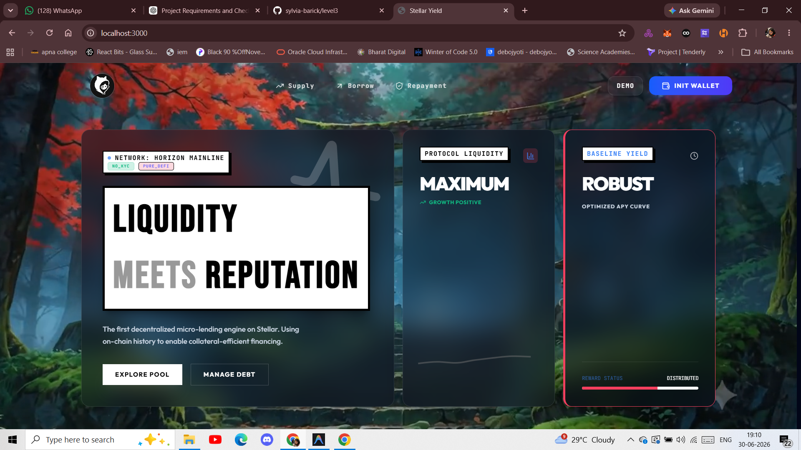
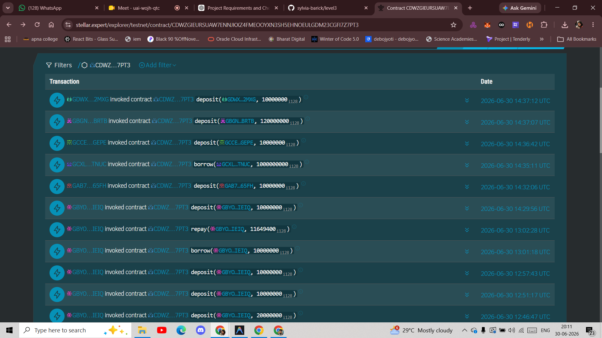
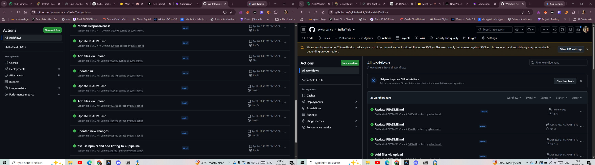
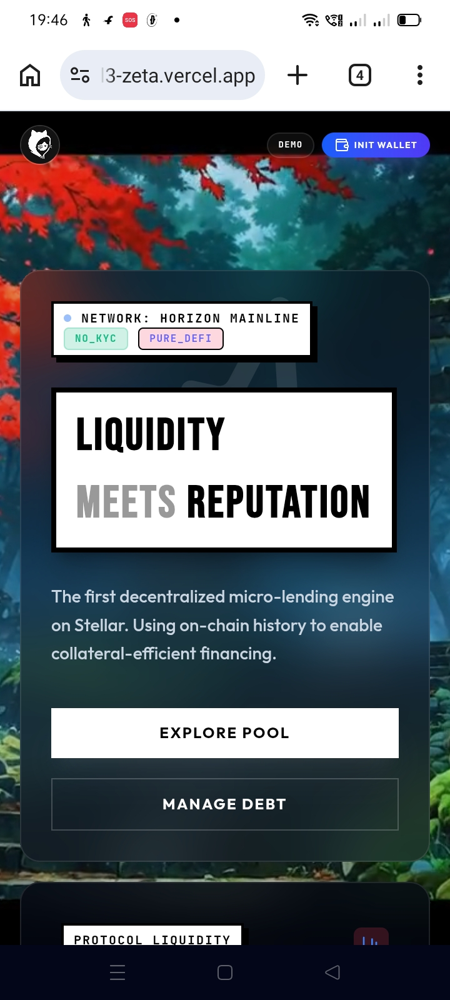
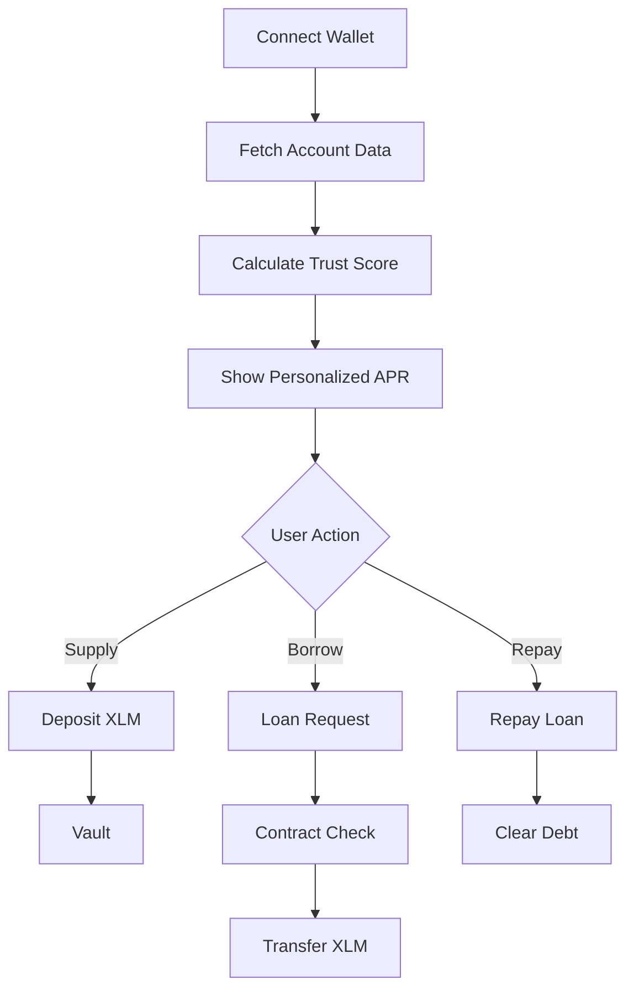

# 🌌 StellarYield: Micro-Lending Protocol
 
<div align="center">
  
  
  [](https://github.com/sylvia-barick/StellarYield/actions)
  [](https://stellar-yield-rose.vercel.app/)
  
  
  
  **Reputation-Driven Liquidity • Algorithmic Credit • Trustless Yield**
</div>

---

## 🚀 Protocol Overview: "Antigravity" Lending
StellarYield is a decentralized, reputation-based lending platform built on the **Stellar Network**. It solves the capital-inefficiency problem in DeFi by using a user's on-chain identity to lower interest rates—defying the "gravity" of traditional high-interest debt.

### 🛡️ Protocol Features & Engineering Upgrades
To meet the rigorous production standards of the Stellar ecosystem, the protocol has been refactored into a **Modular Multi-Contract Architecture**:

* **Inter-Contract Communication:** Implemented synchronous cross-contract calls between the Liquidity Vault and the Reputation Engine. This ensures creditworthiness is verified atomically on-chain before capital is deployed.
* **On-Chain Algorithmic Math:** Transitioned financial logic from the client-side to the smart contract, utilizing **Rust-based Basis Point (BPS) math** for trustless, transparent interest scaling.
* **Persistent State Management:** Leveraged Soroban’s persistent storage to maintain a decentralized registry of user reputation and debt lifecycles, ensuring data longevity on the ledger.
* **Secure Access Control:** Integrated `require_auth()` patterns to ensure that only the contract Admin can initialize the protocol and only verified users can interact with their own debt positions.
* **Mobile-First Responsiveness:** Overhauled the neobrutalist frontend interface to be fully responsive, ensuring seamless navigation and precise layout rendering of complex financial dashboards on all mobile form factors.
* **Automated CI/CD Pipeline:** Every commit is verified by a custom GitHub Actions workflow that automates contract testing (`cargo test`), WASM compilation, and React production build health.
* **Real-Time Reputation Scanning:** Integrated the **Stellar Horizon API** to fetch live account metrics, which are committed to the blockchain as the foundation of the Trust Score.
* **Premium "Antigravity" UI:** A high-fidelity dashboard built with **Next.js and Framer Motion**, providing real-time visual feedback of interest rates floating down as reputation increases.
---

## 🔌 Project Links & Registry
- **Live MVP Demo:** [stellar-yield-rose.vercel.app](https://stellar-yield-rose.vercel.app/)
- **Video Demonstration:** [Watch on YouTube](https://youtu.be/GPmrRI8RiSo)
- **GitHub Repository:** [StellarYield Repo](https://github.com/sylvia-barick/StellarYield)

### 🏛️ On-Chain Contract Registry (Testnet)
| Component | Contract ID |
| :--- | :--- |
| **Liquidity Vault** | `CDWZGIEURSUAW7ENNJKXZ4FMEOOYXN3SH5EHNOEULGDM23CGFI7Z7PT3` |
| **Reputation Engine** | `CCRTRB6UQSLGYQGACMTFBVVXNI6RANLCDIALACGL52Z73EVKTQXFDYTQ` |
| **Asset (Native XLM)** | `CDLZFC3SYJYDZT7K67VZ75HPJVIEUVNIXF47ZG2FB2RMQQVU2HHGCYSC` |

---

## 📐 Economic Model
We use a **Linear Scaling Formula** enforced directly on the blockchain. 


**The Formula:** `Personal APR` = `Base (15%)` - (`Trust Score` / 100 × `Max Discount (10%)`)

| User Category | Trust Score | On-Chain APR |
| :--- | :--- | :--- |
| **New User** | 0 | **15% (Base Rate)** |
| **Active Contributor** | 90 | **6% (Elite Rate)** |
| **Network Whale** | 100 | **5% (Minimum Floor)** |

---

## 🏗️ Technical Architecture


1. **Reputation Layer (Soroban):** Manages persistent ledger storage for user scores and repayment history.
2. **Financial Layer (Vault):** Handles cross-contract token transfers and calculates interest via the Reputation bridge.
3. **Frontend:** Built with **Next.js** and **Framer Motion** for a premium "Antigravity" user experience.
4. **DevOps:** GitHub Actions pipeline ensures 100% test coverage for Rust artifacts.
---
## 👥 User Validation & Onboarding
To validate the MVP, we onboarded 6 testnet users to verify the end-to-end liquidity lifecycle and "Antigravity" interest scaling.

- **User Feedback Data (Excel):** [View Spreadsheet of Responses](https://docs.google.com/spreadsheets/d/1_pxFn-fNdMikKCbjyV5wrrjBzYCOKOajp6D3dPO1CCY/edit?usp=sharing)
- **Verified Testnet Users:**
  1. Debojyoti De Majumder [GC4H63C77AZ4URQKZ7FPWI2JRP4JVRM6OQ2QVNNTU5CO3GF7SAAMQ5L2]
  2. Debdeepa Dutta [GAB7YLJODGSDGQZLOZTNMH2F4OAJ2UTPMTICBRLPAB4DC2OKWAAC65FH]
  3. Diptomoy Das [GCZKPRMN44P3FKEEZMOYCMRWB6KRWJCW6GMSO4MH34DK2CWR4TDK66CI]
  4. Sriz Debnath [GBTVSNJJSKKKSMMSMMSNSNNNNNSNSVVSNMSM]
  5. Rohan Kumar [GBYOEY63WVKXY5KTSQZG4FGCDYY2CV7K3SH4ZSVN6IFDWJ464HPFIEIQ]
  6. Tanmay Chakraborty [GCVBGPRU7YSL7NTK4WQ5SRGE4RC5CV7KNYBVJLNPKMMOUQRFPGRZRF2R]

---
##  On-Chain Proof
<div align="center">
  
</div>

---
---
##  CI-CD Pipeline
<div align="center">
  
</div>

---
---
## Mobile Responsive UI
<div align="center">
  
</div>

---

## The "StellarYield" Concept
```
User connects wallet via Freighter
        │
        ▼
 Reputation Engine scans Horizon API
 [Trust Score calculated: 0 - 100]
        │
        ▼
 System triggers "Antigravity" Formula
 [Base Rate 15% → Floats down based on Score]
        │
        ▼
 User interacts with Soroban Vault
 [Lend XLM for yield OR Borrow at personal APR]
        │
        ▼
 Repayment Center manages debt lifecycle
 [On-chain proof of settlement via Stellar Expert]

 ```

---

## 🏗️ Technical Architecture
1. **Frontend:** Next.js & Framer Motion (for smooth "Antigravity" UI animations).
2. **Smart Contract:** Soroban (Rust) handling the **Stellar Asset Contract (SAC)** for real XLM transfers.
3. **Data Layer:** Horizon API for real-time identity verification.
4. **Wallet:** Integration with **Freighter** for secure transaction signing.
 ```
StellarYield/
├── contracts/
│   └── stellaryield/
│       └── src/
│           └── lib.rs        # Core Soroban lending & vault logic
├── src/
│   ├── app/                  # Next.js App Router (Lend/Borrow pages)
│   ├── components/           # Antigravity UI & Trust Score animations
│   ├── lib/                  # Horizon API client & Soroban SDK utils
│   └── hooks/                # Custom hooks for real-time APR scaling
├── public/                   # Project assets (check.jpg, picc.png)
└── README.md
 ```


---

## 🌊 System Flowchart
1. **CONNECT:** User links Freighter wallet.
2. **SCAN:** Reputation Engine pings Horizon API to calculate Trust Score.
3. **SUPPLY:** User deposits XLM into the Native Core Vault.
4. **BORROW:** User takes a loan at a personalized rate.
5. **REPAY:** User clears debt in the Repayment Center to maintain their score.



---

## 🛠️ How to Use This Website

### 1. Initialize Your Identity
* Open the website and click **Connect Wallet**.
* Ensure you are on the **Stellar Testnet**.
* Watch your **Trust Score** animate based on your actual account history.

### 2. Supplying Liquidity (Lending)
* Enter an amount in the **Input Value** box (e.g., 25 XLM).
* Click **Initialize Supply** and approve the Freighter popup. Your XLM is now earning yield in the Vault!

### 3. Borrowing
* Navigate to the **Borrow Console**.
* View your **Personalized APR** (e.g., 6% if your score is 90).
* Enter the amount you need and click **Borrow**.

### 4. Repaying (Repayment Center)
* Go to the **Repayment Center**.
* View your "Total to Return" (Principal + Accrued Interest).
* Click **Clear Debt** to finalize the transaction and restore your credit line.

---


